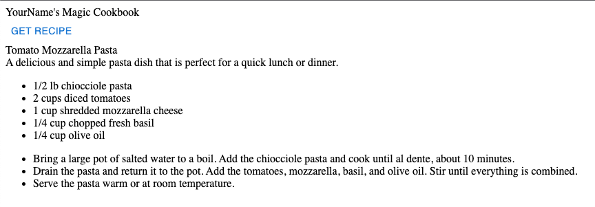

# Step by step guide
This is a step by step guide to implementing the solution, where each step is iteratively added for each pull request. 

## Using GIT to clone the project
<details>
  <summary>:hand: Cloning the Project</summary>


<br>First we need to open up a terminal, then navigate to where we want to store the project. In this example, we'll store it in the Documents folder. 

<details>
  <summary>:pushpin:Windows</summary>

  First open up the file explorer and navigate to where you want to store the project. On the top of the file explorer, you'll see a path such as `C:/Users/Username/Documents` Click this with your mouse and copy the text.

  Now, open up a command line window, you can do this by pressing the start button, write in `cmd` and press enter when the search is finished.

  When the command line window is open, write `cd "C:/Users/Username/Documents"` The path can be pasted in using `Ctrl-V` assuming you copied it earlier. 
  
</details>

<details>
  <summary>:pushpin:MacOS</summary>


First, open up a terminal, you can do this by using Spotlight, which is the magnifying glass on the top right corner of your screen, write in `terminal` and press enter when the search is finished.

  When the terminal is open, write `cd ~/Documents` 

</details>

Now we want to clone the project using git. This can be done using the `git clone` command with a url to the git repository. In github this can be found by pressing the green `Code` button on the repository page, and it should show the link in the popup box. We'll include it in the command here you simplify things.

Use the following command 

```
git clone https://github.com/Markusdreyer/react-workshop.git
```
</details>


## Running the project
<details>
  <summary>:runner: Running the Project</summary><br>


  First off, we want to start up the project, this allows us to immediately see changes and updates in the web browser as we write out code.

  Now we should still have the terminal or command line window open. So, we need to navigate into the project folder. This can be done by writing

  ```
  cd react-workshop
  ```

  Now the first command you want to run is `npm install` this will install all dependencies for the project, when it is finished, you can write in `npm start`, this will start the project, and open up the web browser.

  Now with the web-app running, it will update as soon as you save file after having written new code, this is done by pressing `CTRL-S` for windows pcs or `Command-S` for macs.

</details>


## Step 1 - A simple button and an empty function
<details>
  <summary>:wrench: Getting started</summary><br>


  In this project we'll be using a component library named Material-UI, it provides us with ready made components, such as buttons, text fields and much much more. There are many such libaries available, and there's usually no need to re-invent the wheel and create buttons and other components entirely from scratch. So, with that out of the way, we'll move onto the first step.

  The first step is going to be to just add a simple button with the label "Get Recipe". This needs to be placed within the `return` statement in the `App.tsx`-file. A button can be added using the following.


  ```js
  <Button>MyLabel</Button>
  ```
  

  The next step is to add an empty function. A function is coded like this, but unlike the Button, it should be placed outside the return statement. Lets name the function getRecipe so it is clear what it is supposed to do.


  ```ts
  function myFunction() {
      console.log("Hello world");
    }
  ```

  Now, we want to combine the two, and make the button call/use the function when it is clicked. And this button component has an onClick parameter, see if you can find out how to use this.

  _Note: The button can be stylized in many ways. Take a look at the documentation here for an overview: https://mui.com/material-ui/react-button/_


  <details>
    <summary>:sparkles:Show solution:sparkles:</summary>

  ```ts
    import Button from '@mui/material/Button';

    function App() {

        function getRecipe() {
                console.log("Hello world")
            }

        return (
            <Button onClick={getRecipe}>Get Recipe</Button>
        );
    }

    export default App;
  ```
  </details>

  Now you might be wondering what the console is. The console is a debugging tool that provides a way to view messages, inspect values, and run JavaScript code directly in a web browser or in other JavaScript environments such as Node.js.

  In web development, the console is usually accessed using the JavaScript console object, which is built into the browser's developer tools. You can open the console in most modern browsers by pressing `F12` or by right-clicking on a web page and selecting `Inspect Element`. The console appears as a separate panel within the developer tools.

  Once the console is open, you can use it to view output from your JavaScript code, check the values of variables, and run code directly in the console. This is useful for testing and debugging your code, as well as for exploring the behavior of JavaScript and the web platform.
  Try using it now to see what happens when you click the button on your website.

</details>

## Step 2 - Add a header and center the components
<details>
  <summary>:wrench: Adding more components</summary>

  <br>Now that we have our simple button, we want to add a header, a text at the top of the page, for example "`Your Name`'s Magic Cookbok". 
  Components in react can however only return one main parent element. A parent element is an HTML-like element that contains one or more child elements. The child elements are nested within the parent element and are considered to be a part of the parent element.

  For example:

  ```ts
  return (
          <div>
            <p> I am a child of div</p>
            <p> I am another child of div</p>
          </div>
        );

  ```

  In this example, div is the parent element, and the two p elements are child elements. The parent element div contains and wraps around the two child elements.

  Now, you can go ahead and add a parent element which wraps around our existing button.

<details>
    <summary>:sparkles:Show solution:sparkles:</summary>


  ```tsx
    return (
        <div>
          <Button onClick={getRecipe}>Get Recipe</Button>
        </div>
      );
  ```
</details>


  The next step is to add the header, usually we could just add some text above the button, or use existing html elements such as `<h1> <h2>` etc. but we want to customize this a bit more later on and use more of the existing material-ui components. So we're going to use the `<Box>` component

  ```ts
  <Box>This is some text</Box>

  ```

  As the `Box`is a material-ui component, it has access to many helpful layout options. And many of these will be helpful later on, so we can go ahead and replace the parent `<div>` element with a `<Box>` component.
   Also go ahead and add `YourName's Magic Cookbook`

<details>
    <summary>:sparkles:Show solution:sparkles:</summary>


  ```tsx
    return (
      <Box>
        YourName's Magic Cookbook
        <Button onClick={getRecipe}>Get Recipe</Button>
      </Box>
      );
  ```
</details>
  
All right, now we've finished adding the header! Next step, we'll start having the button do something.

</details>


</details>


</details>

## Step 3 - Querying the backend
<details>
  <summary>:wrench: How to query </summary>
  
Let's get our React-app underway by implementing fetching logic in our app. JavaScript has a "Fetch" API that provides a global fetch() method that provides an easy, logical way to fetch resources across the network.

A basic fetch request is really simple to set up. Have a look at the following code:

```ts
fetch('http://example.com/api')
  .then((response) => response.json())
  .then((data) => console.log(data));
```

Here we are performing a request to an API at 'http://example.com/api' and printing the response to the console. The simplest use of fetch() takes one argument — the path to the resource you want to fetch — and does not directly return the JSON response body but instead returns a promise that resolves with a Response object.

This request is nice, but it is lacking one key feature: the request body. Also, this request is a simple GET request, when performing HTTP requests with a request body, a POST request is used, so we need to change that as well. Here is an example:

```ts
fetch("http://example.com/api", {
      method: "POST",
      body: requestBody,
    })
      .then((response) => response.json())
      .then((data) => console.log(data));
```

### Encapsulating the fetch request
Let's encapsulate this request into the `getRecipe` function we already made:

```ts
//The async keyword allows us to to use "await" to perform asynchronous operations, such as communicating with the backend
async function getRecipe() {
    //Hardcoded list of ingredients. We'll come back to this later, but we need some data to work with for now.
    const requestBody = JSON.stringify({
        ingredients: [
            "tomato", 
            "mozzarella", 
            "basil", 
            "chiocciole pasta", 
            "olive oil"
        ]
    })
    await fetch("http://localhost:8000/recipes", {
      method: "POST",
      headers: { //We also need to tell what kind of data we're sending
        "Content-Type": "application/json",
      },
      body: requestBody,
    })
      .then((response) => response.json())
      .then((data) => console.log(data));
  }
```

### Adding the function to our app
Now try adding this in your App.tsx file, and check the console output after trying to click the button. It might take a few seconds-half a minute before you get a result, depending on the server! 🐢
  
<details>
  <summary>:sparkles:Show solution:sparkles:</summary>
  
  
```ts
import { Box } from '@mui/material';
import Button from '@mui/material/Button';

function App() {
  
  function getRecipe() {
    const requestBody = JSON.stringify({ingredients: ["tomato", "mozzarella", "basil", "chiocciole pasta", "olive oil"]})
    await fetch("http://localhost:8000/recipes", {
      method: "POST",
      headers: {
        "Content-Type": "application/json",
      },
      body: requestBody,
    })
      .then((response) => response.json())
      .then((data) => console.log(data));
  }
  
  return (
      <Box>
          YourName's Magic Cookbook
          <Button onClick={getRecipe}>Get Recipe</Button>
      </Box>
  );
}
export default App;
```

</details>
</details>
    
## Step 4 - Presenting the results
<details>
  <summary>:wrench: Presenting the results </summary>

Now we want to create a new component for recipe related things. 
  
First, create a folder named `components` under the `src` folder. If you're using Visual Studio Code, you can right click the `src` directory and click create new folder and name this components. Then right click the `components` folder and click create new file. Let's name this new file `Recipe.tsx`

Next up, we'll have a look at how the data in the recipe is structured.

```ts
{
    "title": "Caprese Pasta",
    "description": "A delicious and simple pasta dish featuring the classic Italian flavors of tomato, mozzarella, and basil.",
    "ingredients": [
        "2 cups of cherry tomatoes, halved",
        "1 cup of mozzarella, cubed",
        "1/4 cup of fresh basil, chopped",
        "250 grams of chiocciole pasta",
        "3 tablespoons of olive oil"
    ],
    "steps": [
        "Bring a large pot of salted water to a boil.",
        "Add the chiocciole pasta and cook for 8-10 minutes, or until al dente.",
        "Drain the pasta and set aside.",
        "In a large bowl, combine the halved tomatoes, cubed mozzarella, and chopped basil.",
        "Add the cooked pasta to the bowl and mix to combine.",
        "Drizzle the olive oil over the pasta and mix until all the ingredients are evenly coated.",
        "Serve the pasta warm or cold."
    ]
}
```

We can see here that we're dealing with a structure such as this
  
```ts
title: string,
description: string,
ingredients: string[] 
steps: string[]
```
  
So to be able to use a state for multiple fields, we usually have to use a state object structure. Now, we're going to use this object structure in multiple components, in both our App.tsx and our Recipe.tsx components. When we need to use it in several places, or it is a larger object structure it is often helpful to create an interface that defines the structure. See an example of an interface below.
  
```ts
interface interfaceName{
  propertyName1: propertyType1
  propertyName2: propertyType2
}
  
To use this interface in other components, we usually have to add an export before the interface, e.g.
  
export interface InterfaceName {
  ....
}
  
```

Now, go ahead and try creating an interface for the recipe, lets name it RecipeObject
  
<details>
  <summary>:sparkles:Show solution:sparkles:</summary>
  
```ts
export interface RecipeData{
  title: string
  description: string
  ingredients: string[]
  steps: string[]
}
```
  
</details>
  
Next up, we'll create the actual component! Lets start with something along these lines
  
```ts
import { Box } from "@mui/material";

function Recipe(){
    return (
        <Box>
          "text"
        </Box>
    )
}
```
  
Now, we need this Recipe component to actually receive RecipeData, it does this through the use of something called `props`. In React, `props` (short for "properties") is a way to pass data from a parent component to its child components. Props are used to customize the behavior and render of a component by providing it with external data.

See the example below to see how a prop is received by a component.
  
```ts
function MyTitleFunction(props: {title: string){
  <Box>
    {props.title}
  </Box>
}

```
  
This works slightly different when using an interface for the prop, as all the types and property names are already defined. So when using an interface it might look a bit like this

```ts
interface MyTitleInterface{
  title: string
}
  
function MyTitleFunction(props: MyTitleInterface){
  <Box>
    {props.title}
  </Box>
}
```
  
So, now you can try to make use of the RecipeData interface and pass this as a prop to your Recipe component.
  
<details>
  <summary>:sparkles:Show solution:sparkles:</summary>
  
```ts
import { Box } from "@mui/material";

export interface RecipeData{
    title: string
    description: string
    ingredients: string[]
    steps: string[]
}

function Recipe(props: RecipeData){
    return (
        <Box>
            {props.title}
        </Box>
    )
}
```
</details>

Right, now we want to make use of all the properties that are passed in, this is simple for the single string properties, but requires some mapping when it comes to Lists or Arrays, e.g. when we have multiple ingredients or steps. So lets take a look at an example of how to map a list of strings.
  
```ts
Lets say we have this list of names
  
const names: [NameData] = [{firstName: "Jack", lastName: "Syvertsen"}]

interface NameData {
  firstName: string,
  lastName: string
}

  
function UnorderedNameComponent(props: names){
  return(
    <Box>
        <ul>
            {props.names.map((element, index) => (
                <li key={index}>
                    {element}
                </li>
            ))}
        </ul>
    </Box>
  )
}
  
```

So there's a few things happening here. The `<ul>` element in HTML stands for "Unordered List". It is used to create a list of items, where the order of the items does not matter. The items in an unordered list are usually represented by bullet points.

The `<ul>` element is used in conjunction with the `<li>` element, which stands for "List Item". Each item in the list is contained within an `<li>` element, and multiple `<li>` elements are grouped within the `<ul>` element.
  
The code in the example creates an unordered list `<ul>` and uses the map method to render a list of items based on an array of names passed as a prop to the component. The map method is used to iterate over the array and render a `<li>` for each element, with the text content being the element and the key being the index of the element in the array.
  
It might sound a bit more complex than it is, in short the list is meant to show a set of names, and it is displayed as a bullet-point list, where each name is a separate item on the list.
  
Now, you can go ahead and try to implement the Recipe function in its entirety. What we want is something that ends up looking like this
  

  
To test your solution you can use this example data
  
```ts
const ExampleRecipeData = {
    
  title: "Caprese Pasta",
  description: "A delicious and simple pasta dish featuring the classic Italian flavors of tomato, mozzarella, and basil.",
  ingredients: [
      "2 cups of cherry tomatoes, halved",
      "1 cup of mozzarella, cubed",
      "1/4 cup of fresh basil, chopped",
      "250 grams of chiocciole pasta",
      "3 tablespoons of olive oil"
  ],
  steps: [
      "Bring a large pot of salted water to a boil.",
      "Add the chiocciole pasta and cook for 8-10 minutes, or until al dente.",
      "Drain the pasta and set aside.",
      "In a large bowl, combine the halved tomatoes, cubed mozzarella, and chopped basil.",
      "Add the cooked pasta to the bowl and mix to combine.",
      "Drizzle the olive oil over the pasta and mix until all the ingredients are evenly coated.",
      "Serve the pasta warm or cold."
  ]
  
}
 
```

<details>
  <summary>:sparkles:Show solution:sparkles:</summary>
  
```ts
import { Box } from "@mui/material";

export interface RecipeData{
    title: string
    description: string
    ingredients: string[]
    steps: string[]
}

function Recipe(props: RecipeData){
    return (
        <Box>
            <Box>
                {props.title}
            </Box>
            <Box>
                {props.description}
            </Box>
            <Box>
                <ul>
                    {props.ingredients.map((element, index) => (
                        <li key={index}>
                            {element}
                        </li>
                    ))}
                </ul>
            </Box>
            <Box>
                <ul>
                    {props.steps.map((element, index) => (
                        <li key={index}>
                            {element}
                        </li>
                    ))}
                </ul>
            </Box>
        </Box>
    )
}
  
export default Recipe;
    
```
</details>

</details>
  
## Step 5 - State management
<details>
  <summary>:wrench: Presenting the results </summary>
  
<br> In React, "state" is a way to store and manage component-level data that affects the behavior and render of a component. It is an object that holds data that can change over time, and it is an essential part of building dynamic and interactive user interfaces. It might sound a bit complicated, but it's actually not that hard to use. So lets get going with an example
  
```ts
function Counter() {
  const [counter, setCounter] = useState(0);
  
  return (
    <Box>
      {counter}
      <Button onClick={setCounter(counter + 1)}>Count</Button>
    </Box>
  )
}
```
  
<br>Now, in this example we have the state `counter`, and a setter for this state named `setCounter`. The `counter` is initialized using `useState(0)` which initializes the state with the value 0. 

So in the browser, this would show the number 0, and a button labeled Count, and each click of the button would set a new state, this state is based on the previous state and adds 1 to this. And as it is a state, React knows that it should update the render (what is shown) when the value changes. 

What we want in our application is to have a recipe state. Lets see an example of how this can look

```ts
import { useState } from 'react';
import { RecipeData } from './components/Recipe'
  
function App() {
  const [recipe, setRecipe] = useState({} as RecipeData)
}
```
  
Try adding this to your code in the `App.tsx` file now.
  
Next up we want to actually set the recipe state when we get some data back from pressing the button, instead of just logging it to the console. See if you can figure out how to do this.
  
<details>
  <summary>:sparkles:Show solution:sparkles:</summary>
  
```ts
import { Box } from '@mui/material';
import Button from '@mui/material/Button';
import { RecipeData } from './components/Recipe';
import { useState } from 'react';

function App() {
  const [recipe, setRecipe] = useState({} as RecipeData)
  
  async function getRecipe() {
    const requestBody = JSON.stringify({ingredients: ["tomato", "mozzarella", "basil", "chiocciole pasta", "olive oil"]})
    await fetch("http://localhost:8000/recipes", {
      method: "POST",
      headers: {
        "Content-Type": "application/json",
      },
      body: requestBody,
    })
      .then((response) => response.json())
      .then((data) => setRecipe(data));
  }
  
  return (
      <Box>
          YourName's Magic Cookbook
          <Button onClick={getRecipe}>Get Recipe</Button>
      </Box>
  );
}
export default App;
    
```
</details>
  
So, next we want to use the actual recipe data! Lets use our Recipe component and pass the needed props to it. The component can be used like this
  
```ts
  <Recipe title={recipe.title} description={recipe.description}....../>
  
  Notice that we are writing this as <Recipe ... /> instead of <Recipe ...></Recipe>
  This is just a simplification and can make the code cleaner and easier to read when no props are passed 
```
  
Now try implementing this yourself!
  
<details>
  <summary>:sparkles:Show solution:sparkles:</summary>
  
```ts
import { Box } from '@mui/material';
import Button from '@mui/material/Button';
import Recipe, { RecipeData } from './components/Recipe';
import { useState } from 'react';

function App() {
  const [recipe, setRecipe] = useState({} as RecipeData)
  
  async function getRecipe() {
    const requestBody = JSON.stringify({ingredients: ["tomato", "mozzarella", "basil", "chiocciole pasta", "olive oil"]})
    await fetch("http://localhost:8000/recipes", {
      method: "POST",
      headers: {
        "Content-Type": "application/json",
      },
      body: requestBody,
    })
      .then((response) => response.json())
      .then((data) => setRecipe(data));
  }
  
  return (
      <Box>
          YourName's Magic Cookbook
          <Button onClick={getRecipe}>Get Recipe</Button>
          <Recipe title={recipe.title} description={recipe.description} ingredients={recipe.ingredients} steps={recipe.steps}/>
      </Box>
  );
}
export default App;
```
  
</details>
  
Now you might notice nothing is showing up in the browser anymore, this is due to the Recipe receiving null values, as the title, description and so on haven't been initialized. We'll sort this out by using something called conditional rendering, which is basically an `if` statement.
  
```ts
  {recipe.title && <Recipe ......./>}
  
  In essence this means 
  
  if (recipe.title != null){
    return <Recipe ......></Recipe>
  }
```

<details>
  <summary>:sparkles:Show solution:sparkles:</summary>
  
```ts
import { Box } from '@mui/material';
import Button from '@mui/material/Button';
import Recipe, { RecipeData } from './components/Recipe';
import { useState } from 'react';

function App() {
  const [recipe, setRecipe] = useState({} as RecipeData)
  
  async function getRecipe() {
    const requestBody = JSON.stringify({ingredients: ["tomato", "mozzarella", "basil", "chiocciole pasta", "olive oil"]})
    await fetch("http://localhost:8000/recipes", {
      method: "POST",
      headers: {
        "Content-Type": "application/json",
      },
      body: requestBody,
    })
      .then((response) => response.json())
      .then((data) => setRecipe(data));
  }
  
  return (
      <Box>
          YourName's Magic Cookbook
          <Button onClick={getRecipe}>Get Recipe</Button>
          {recipe.title && 
            <Recipe 
              title={recipe.title} 
              description={recipe.description} 
              ingredients={recipe.ingredients} 
              steps={recipe.steps}
            />
          }
      </Box>
  );
}
export default App;

```
  
</details>

Perfect, now you've learned a little bit about state management as well! Next up, we'll add a new component with inputs, and another state to change the ingredients we're using.
  
</details>
  
## Step 6 - Autocomplete component and input
<details>
  <summary>:wrench: Time for some input </summary>
  
<br> So now we're finally going to add some more interactivity by using an autocomplete component! 
We won't go into details regarding the Autocomplete component, and will focus only on what we need to use. You can see an example of how it can be used below

```ts
<Autocomplete 
  multiple // Allows you to select multiple items
  filterSelectedOptions // Filters out selected items
  disableCloseOnSelect // Prevents closing the dropdown menu on selecting an item
  options={["tomato", "mozarella"]} // The options shown in the dropdown menu
  onChange={(event: any, newValue: string[]) => { // Handles changes, allowing you to set a state with the new values
    setIngredients(newValue); // Here we're using a [ingredient, setIngredient] = useState([""]) state
  }}
  renderInput={(params) => (
    <TextField {...params} label="Ingredients" /> // The input field, showing what you type if you're using the built in search function
  )
}/>
```

  
  
</details>
